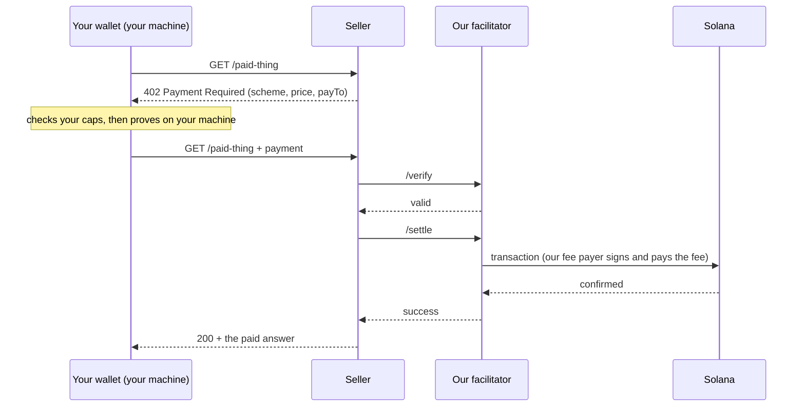

# How Shinjuku Shielded works

Shinjuku Shielded is a privacy-only x402 facilitator on Solana mainnet.
Agents use it through two tools: the one-file wallet (`shinjuku-wallet.mjs`)
and the wallet's local MCP server. This page explains the parts in plain
words. [privacy-model.md](privacy-model.md) says what each party sees.

## x402 in one paragraph

x402 puts payments into plain HTTP. A client asks a seller for a URL. The
seller answers `402 Payment Required` and lists what it accepts: a scheme, a
network, a token, a price, and a `payTo`. The client builds a payment and
sends the same request again with the payment attached. The seller's x402
middleware gives the payment to a facilitator. The facilitator checks it
(`/verify`) and puts it on chain (`/settle`). When the settle succeeds, the
seller returns the paid answer. The seller writes no blockchain code. It only
points its middleware at a facilitator.

## Our facilitator

- Facilitator URL: `https://shinjukustaition.com/api/x402`
- Routes the seller's middleware calls: `/verify` and `/settle`.
- What it offers: `GET https://shinjukustaition.com/api/x402/supported`.

On 2026-10-08 that route listed three schemes, all on Solana mainnet
(`solana:5eykt4UsFv8P8NJdTREpY1vzqKqZKvdp`), and the `discovery`
extension:

| Scheme | What is hidden on chain | Token | Fee payer that signs |
|---|---|---|---|
| `shielded-exact` | The payer and the amount. The payment is a proof inside the shielded pool. | USDC | `6LhX4sv2JM4YXPgBQx9eemzXYJtNwyHM6JxkPiGV3dZS` |
| `confidential` | The amount and the seller. Confidential transfer to a one-time account. | shUSDC (`7Xwrv1RK1m8oijzWXTSVj5FeWkpihRjoPzpJ9j371Njr`, wrapped USDC) | `6LhX4sv2JM4YXPgBQx9eemzXYJtNwyHM6JxkPiGV3dZS` |
| `exact` (pocket) | Your wallet's own key. The amount and the seller are public. | USDC | `zM8c2oE4QibuKc93sgCpA6i564vDygXGa67S1ag4rX2` |

The shielded pool for `shielded-exact` is program
`8PYPw3FSFTMbvSneXdcoH6jNoN4VD23nHwPY2A2riUy1`, pool
`AAG16mNWTtC1sBeu2tTVTwWjqWXCefLTCByVPj5X3kV8`.

### `shielded-exact`: the payer is hidden in the pool

You first move USDC into the shielded pool (a deposit). Your balance is then
a set of notes that only your seed can spend. To pay, the wallet makes a
zero-knowledge proof on your machine: "I own unspent notes worth this price."
Our facilitator checks the proof and sends it. The Solana program checks it
again on chain, marks the notes spent, and records the new notes.

On chain, the payment is a call to the pool program, signed by our fee
payer. It moves no token and shows no amount. Your wallet's key is not in
it. Limit: this hides you only among the other users of the pool. Our pools
are new and have few users (see "Privacy needs a crowd" in
[privacy-model.md](privacy-model.md)).

### `confidential`: the amount is hidden (Lane B)

This scheme uses Solana confidential transfers (Token-2022) of shUSDC. The
seller registers two public keys and opens one-time receiving accounts,
called slots. The payer pays from a pocket of the V0b pool, our
hidden-amount vault.

The payer's wallet reserves one of the seller's slots, builds the transfer,
and proves the amount on the payer's machine. Our facilitator checks that
proof (`amountCheck: "dleq-v1"`): a transfer below the price is refused, and
nothing moves. The payment is 5 transactions from our fee payer. The chain
shows no amount and no seller. The seller checks each slot itself with
`laneb receipts --verify`.

Limits: our facilitator sees the amount, the seller, the URL, and the payer
account. The seller sees the payer's pocket address. Who paid rests on the
V0b pool's crowd, which is small.

### `exact` from a pocket: standard sellers work

A pocket is a one-time USDC account. Its key comes from your seed. The
wallet fills it ahead of time from the shielded pool. Our relayer sends the
exit into the pocket and pays its fees. A payment from the pocket is then a
standard x402 `exact` payment: one fast token transfer.

- Each seller gets its own pocket. The chain never shows one pocket paying
  two sellers.
- Our facilitator settles `exact` only from pockets that our pool filled.
- A pocket also pays any other Solana x402 `exact` endpoint that takes USDC,
  whichever facilitator settles it.

Limits: the chain shows the pocket, the seller, the amount, and the time.
It does not show your wallet's own key. With few depositors in the pool, an
observer who lists the pool deposits can link the pocket to its depositor.

## The flow of one payment

1. The seller answers 402 with its price.
2. The wallet refuses a price above your cap before it signs anything.
   (`--max-payment` on `curl`, `--maximum-atomic` on `pay`, and
   `--max-payment` with `--max-session` on `mcp`.)
3. The wallet makes the proof or the transfer on your machine. Your keys
   never leave it.
4. The wallet writes the payment to its own log before it sends it. A rerun
   with the same request ID never pays twice.
5. The seller's middleware calls `/verify`, then `/settle`.
6. Our facilitator signs as the fee payer, sends the transaction, and pays
   the network fee.
7. The seller returns the paid answer.

## Self-custody

- `init` makes a Solana key and a shielded seed on your machine.
- We never receive your keys, seed, passphrase, or recovery file. We cannot
  recover them.
- `recover` rebuilds your notes from your seed, the public chain history,
  and the encrypted memos.
- Our facilitator and relayer pay network fees. They never hold your money.

## What runs where

| Where | What runs there |
|---|---|
| Your machine | The wallet file (Node.js 22 or later). Your keys and seed, encrypted with your passphrase. The wallet's log of every step that moves value. The provers that make your proofs (Linux x86-64; on Windows through WSL; macOS is not supported). The local MCP server, if you start it. |
| Our server | The facilitator (`/api/x402/supported`, `/verify`, `/settle`). The relayer for relayed deposits, exits, and pocket fills. The encrypted memo service. A Solana RPC relay (`/api/solana-rpc`), so you need no RPC of your own. The Lane B routes. The opt-in seller list. An onion service. The key service of the V0b pool. |
| Solana | The shielded pool program and its pool, which check every proof. The V0b vault. The shUSDC mint (Token-2022 confidential transfers). Every transaction is public. |

Our server never holds your keys. It does see what it processes. See
[privacy-model.md](privacy-model.md).

## How money gets in and out

- **In.** `add-funds` runs every funding step. Three routes: an exchange
  withdrawal to a one-time address, a ChangeNOW swap, or Privacy Cash. Each
  route has its own limits: `node shinjuku-wallet.mjs help add-funds`.
  The MCP tool `wallet_shield` deposits the wallet key's own public USDC.
  The chain then shows that key and the amount.
- **Out.** `unshield` sends part of your balance to a public USDC account.
  Our relayer sends the exit and pays its fees. The chain shows the amount
  and the recipient. It does not show which deposit paid it.

## Where to go next

- Install and check the wallet: the [README](../README.md).
- Give your agent the wallet as tools:
  [ShinjukuStaition/shinjuku-mcp](https://github.com/ShinjukuStaition/shinjuku-mcp).
- Sell: [sell-with-shinjuku.md](sell-with-shinjuku.md).
- Live mainnet transactions: [proof.md](proof.md).
